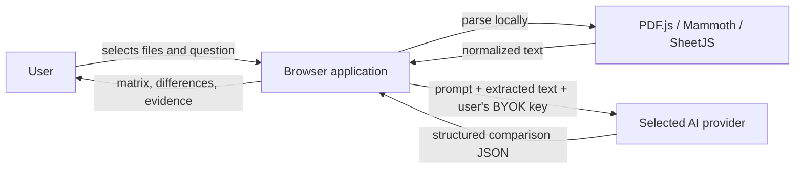
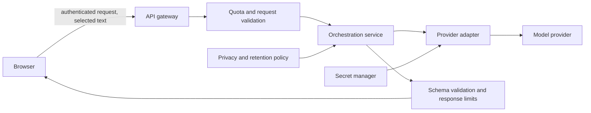

# Architecture and design decisions

## Context

Compare AI compares a small set of user-selected documents across arbitrary business domains. The product must identify useful dimensions itself, show where a claim came from, surface absent information, and leave the decision to the user.

## System context



The browser sends extracted text to the selected model provider. The app does not operate a file-upload or application API server.

## Components

| Component | Responsibility | Boundary |
| --- | --- | --- |
| `index.html` | Accessible application structure and parser library entry points | No application logic |
| `src/app.js` | UI events, in-memory session state, workflow orchestration, and rendering | Coordinates services; owns DOM access |
| `src/services/document-service.js` | Type dispatch, local extraction, normalization, truncation, and extraction warnings | Accepts `File`; returns a normalized document record |
| `src/services/comparison-service.js` | Evidence-first prompt, provider-specific HTTP requests, and JSON parsing | Accepts text and explicit provider settings; returns model text |
| `src/config.js` | Provider metadata and product limits | No credentials or mutable session state |
| `src/styles.css` | Responsive visual system | Presentation only |

### Document record

```js
{
  name: string,
  type: "pdf" | "docx" | "xlsx" | "xls" | "csv" | "txt" | "md",
  text: string,
  truncated: boolean,
  warning: string
}
```

### Comparison result

The model is asked to return JSON containing `document_names`, `dimensions`, `matrix`, `summary`, `key_differences`, `needs_clarification`, and `risks`. Matrix cells include `value`, `source`, and `evidence`. Missing information should be represented as “Not stated”; conclusions must not rank or choose a winner.

## Request lifecycle

1. The user chooses two to ten supported files and optionally adds a comparison question.
2. The document service parses each file locally, normalizes whitespace, and truncates each extracted text body at 18,000 characters.
3. The comparison service wraps documents as untrusted data and builds an evidence-oriented prompt.
4. The selected adapter submits that prompt directly to the configured provider. The provider key remains in page memory.
5. The response parser tolerates common Markdown fences, parses JSON, and the UI renders the matrix and evidence drawer.
6. Clearing the session drops selected file references, extracted document state, and results.

## Quality attributes

- **Privacy:** original files remain in the browser; only extracted text is sent to the chosen provider.
- **Traceability:** every matrix value can carry a source reference and supporting quote.
- **Resilience:** extraction warnings, empty-text checks, provider error messages, and JSON validation are surfaced to the user.
- **Portability:** native browser modules and static hosting avoid a required application server.
- **Extensibility:** new file extractors belong in the document service; provider APIs belong in the comparison service; UI changes remain in the app layer.

## Security and operational constraints

- This is a BYOK prototype, not a multi-user SaaS security architecture. A key entered in a browser can be inspected by browser code, extensions, or a compromised origin.
- Provider CORS rules may prevent direct browser requests. The user must follow the provider's current browser/API policy.
- Document content is untrusted input. Prompt instructions explicitly isolate it as data, but prompt injection cannot be fully prevented by prompt wording alone.
- The app loads pinned parser versions from public CDNs. For a controlled release, self-host dependencies or add Subresource Integrity, automate dependency updates, and review license/security notices.
- Static hosting must use HTTPS. Provider request limits, model context windows, retention settings, and account permissions are outside this client’s control.
- Image-only PDFs are not OCR processed. Text beyond the per-document cap is omitted and visibly marked.

## Production evolution

A production deployment should introduce a same-origin backend/API boundary:



That backend should own shared provider secrets, authentication, quotas, request-size limits, output schema validation, observability with redacted content, and an explicit retention/deletion policy. Add OCR, asynchronous jobs, object storage, and result persistence only when product requirements justify their additional privacy and operational cost.

## Decision log

- **Static browser-first deployment for this iteration:** preserves the prototype’s local parsing and BYOK model while making boundaries explicit.
- **Native ES modules:** separates services without adding a bundler or dependency installation requirement.
- **No default winner:** comparisons provide evidence and trade-offs without assuming user priorities.
- **Cap extracted text per file:** limits accidental token and provider cost growth; the UI reports truncation warnings.
