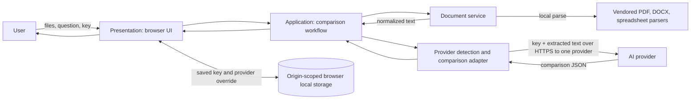

# Architecture and security decisions

## Scope

Compare AI is a browser-first document comparison application distributed as static files. It uses client-side parsing and a user-supplied provider API key. It does not currently include a hosted application API, identity service, or database.

## System context



## Client-side tiers

| Tier / module | Responsibility | Data boundary |
| --- | --- | --- |
| Presentation: `index.html`, `src/styles.css`, rendering code in `src/app.js` | Settings panel, uploads, progress, result matrix, evidence drawer | Owns DOM and transient file/result state |
| Application: workflow code in `src/app.js` | Coordinates validation, parsing, comparison, and results | Receives file records and credential metadata from services |
| Document service: `src/services/document-service.js` | Type dispatch, local extraction, normalization, and truncation | Receives `File`; returns a normalized document record |
| Provider detection: `src/services/provider-detection.js` | Recognizes only unambiguous key prefixes; resolves an explicit fallback for ambiguous formats | Never sends a key or probes a provider |
| Comparison integration: `src/services/comparison-service.js` | Builds evidence-oriented prompt and calls one provider adapter | Receives the key in memory and extracted text; returns provider text |
| Browser persistence: `src/services/key-store.js` | Saves/removes the user's API key and optional provider override | Origin-scoped `localStorage`; key is plaintext at rest |
| Configuration: `src/config.js` | Product limits, provider API endpoints, default models | Contains no credentials or mutable session state |
| Local vendor assets: `src/vendor/` | PDF.js, Mammoth, and SheetJS browser bundles plus license texts | Served from this app origin; see the local version inventory |

This separates concerns in the browser, but it is not a backend N-tier system. Static cloud hosting and a loopback-only laptop server use the same application files. A production multi-user service needs a separate server tier described below.

## Data contracts

### Extracted document

```js
{
  name: string,
  type: "pdf" | "docx" | "xlsx" | "xls" | "csv" | "txt" | "md",
  text: string,
  truncated: boolean,
  warning: string
}
```

### Comparison result

The model is asked for `document_names`, `dimensions`, `matrix`, `summary`, `key_differences`, `needs_clarification`, and `risks`. Each matrix cell carries `value`, `source`, and `evidence`. The UI escapes model output before rendering; missing information is represented as “Not stated.”

## Request lifecycle

1. User selects two to ten supported files in the presentation tier.
2. The document service parses each file locally, normalizes whitespace, and caps each text body at 18,000 characters.
3. The app reads the saved key and resolves a provider locally. Recognized prefixes are routed directly. If a prefix is ambiguous, the app makes no provider call until the optional provider override is selected.
4. The comparison service wraps file contents as untrusted data and builds the comparison prompt.
5. Exactly one provider adapter sends extracted text and the API key over HTTPS. The app does not test the key against multiple endpoints.
6. The response is parsed and validated, then presented as a matrix and evidence drawer.

## Provider detection behavior

Provider key formats are not a universal protocol and may change. Detection only uses known provider-specific patterns (for example, Anthropic `sk-ant-`, modern OpenAI `sk-proj-`/`sk-svcacct-`, and legacy Google `AIza` keys). Generic `sk-` keys and unrecognized future formats are not guessed because OpenAI-compatible providers can use overlapping shapes. Advanced settings offers a provider override only for that case. Google documents multiple key types and an ongoing migration, so future formats may need a reviewed detector update ([Gemini API key guidance](https://ai.google.dev/gemini-api/docs/generate-content/api-key)). Update the detector against current provider guidance before adding patterns.

## Security and privacy boundaries

- The API key is saved in the browser's origin-scoped `localStorage` so it survives reloads. It is plaintext, not encrypted. Clearing the browser cache alone may not remove it; remove it in Settings or clear site data for the app origin.
- A public static browser app cannot keep a provider key secret from the browser. OpenAI's own guidance recommends routing requests through a backend instead of deploying keys in browsers ([API key safety guidance](https://help.openai.com/en/articles/5112595-best-practices-for-api-key)). Persistent BYOK storage is a convenience mode with that limitation, not suitable for shared/managed credentials.
- Any JavaScript running on this origin can access `localStorage`. Vendoring parser libraries and enforcing a Content Security Policy reduces third-party script exposure, but cannot make a browser-held key secret from the user, browser extensions, developer tools, or compromised same-origin code.
- API credentials are not placed in the DOM after save, URLs, source files, Git, analytics, or console logs. Provider errors are redacted before display. The user sees only whether a key is saved and the provider label, never the key itself.
- The app sends a credential only to the one provider resolved for the comparison. It never sends test requests to identify a key.
- Original file bytes are parsed locally. Extracted text is sent to the selected provider; that provider's retention, training, billing, and account policies apply.
- A meta Content Security Policy allows scripts and styles only from this origin and limits outbound connections to the supported provider APIs. Cloud deployments must use HTTPS and verify their host preserves relative asset paths and the policy. On GitHub Pages, repositories under the same `username.github.io` hostname share an origin; a separate custom domain is safer for persistent credentials.
- Treat document content as untrusted input. Prompt delimiting helps resist embedded instructions but cannot fully prevent prompt injection.
- Model response content is escaped before insertion into the page. Never log API keys, prompts, extracted document text, or raw provider response bodies.

## Distribution

- **Customer laptop:** deliver the repository or release archive. `run-local.sh` (macOS/Linux) or `run-local.bat` (Windows) serves the files at `127.0.0.1:4173`. A loopback server is required for browser modules and PDF workers; opening `index.html` directly is unsupported.
- **Cloud static host:** serve repository files over HTTPS. No build or database is needed. Browser local storage is per host and browser profile, so keys are not shared between local and cloud instances.
- **Cloud service with centrally managed credentials:** add an authenticated same-origin API/proxy. Keep server credentials in a secret manager, enforce request limits/quotas, redact observability, validate response schemas, and define retention/deletion behavior. The browser should not receive shared provider secrets.

## Decision log

- Use native ES modules and vendored browser parsers so the same static asset tree can run on localhost or a cloud static host without a CDN runtime dependency.
- Keep AI setup in a separate, closed-by-default settings panel so it does not interrupt file comparison.
- Persist BYOK settings per origin because the user asked to avoid re-entering a key. Clearly disclose that local storage is plaintext and removable.
- Prefer transparent ambiguity over sending a key to multiple possible providers.
- Keep document extraction local and limit extracted text to control accidental request size and cost.
- Return evidence and differences without selecting an overall winner.
